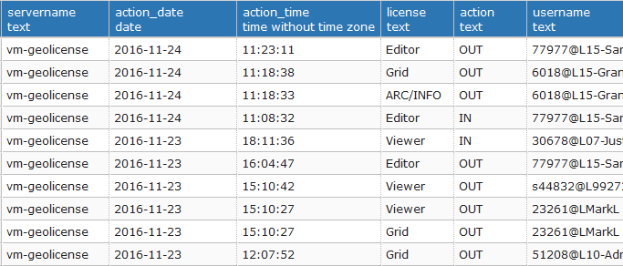

#Save ArcGIS License Manager log files

By default, the ArcGIS license server log files are over-written every day. This script extracts the important
information from the log files (namely the date and time that each license was checked out/in, and by which user),
such that the license usage can be analysed and patterns discerned, etc.

The outputs are stored in a PostGreSQL table, but any other database would suffice. A database is preferable to a
text file as it's easier to query for existing entries, to avoid creating duplicate entries.

This script should be run regularly as a scheduled task to avoid losing information when the log file is over-written.

Before running this script:
 - Ensure that the license manager log file is accessible to this script (eg share the folder on the network)
 - Set the PostGreSQL password in an environment variable 'pgpassword'
 - Create a PostGreSQL table containing the fields:
   - servername (text)
   - action_date (date)
   - action_time (time without timezone)
   - license (text)
   - action (text)
   - username (text)

####Sample output
